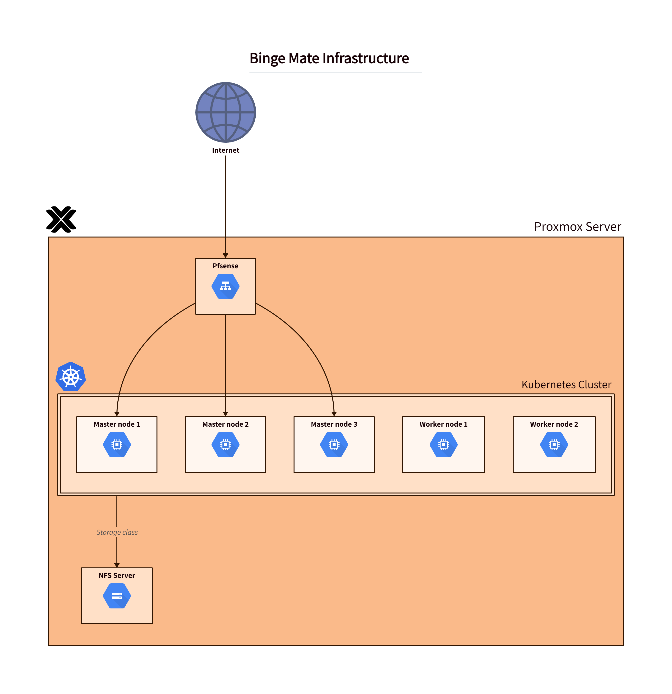

### BingeMate Infrastructure

> Live reload of the infrastructure diagram
```bash
d2 --layout=dagre -t 101 infra_diagram.d2 -w infra_diagram.png
```
> Generate the infrastructure diagram
```bash
d2 --layout=dagre -t 101 infra_diagram.d2 infra_diagram.png
```

