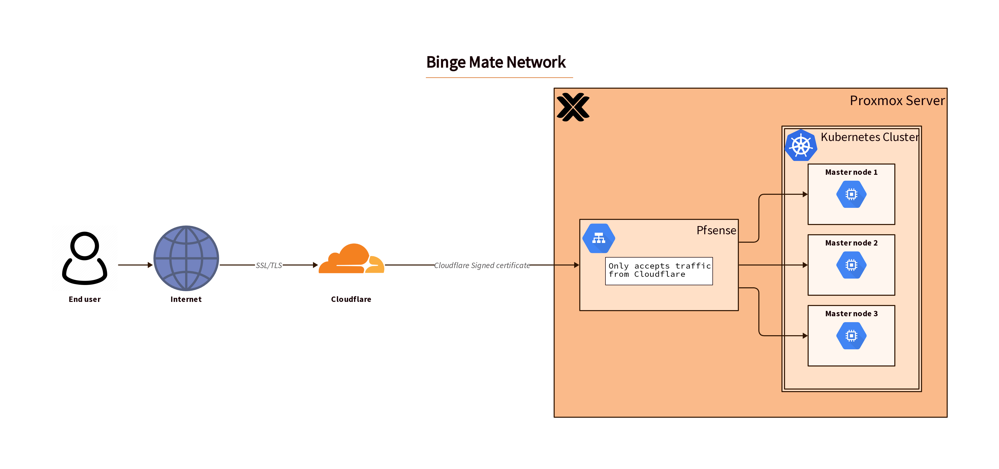

## BingeMate Network

> Live reload of the infrastructure schema
```bash
d2 --layout=elk -t 101 network_diagram.d2 -w network_diagram.png
```
> Generate the infrastructure schema
```bash
d2 --layout=elk -t 101 network_diagram.d2 network_diagram.png
```

