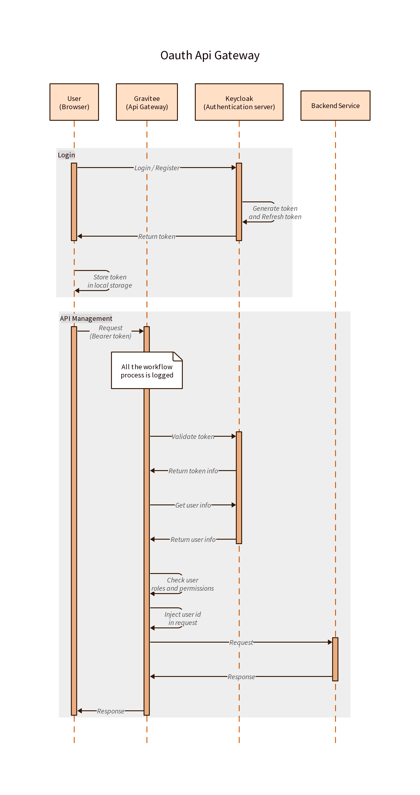

# BingeMate Features

## MindMap

[XMind](https://xmind.works/share/vHmaBaXi)

[](https://xmind.works/share/vHmaBaXi)

## Users

### Auth

> Live reload of login sequence diagram
```bash
d2 --layout=dagre -t 101 login.d2 -w login.png
```
> Generate the login sequence diagram
```bash
d2 --layout=dagre -t 101 login.d2 login.png
```


## Api Gateway

### Oauth routes

> Live reload of oauth sequence diagram
```bash
d2 --layout=dagre -t 101 oauth_api_gateway.d2 -w oauth_api_gateway.png
```
> Generate the oauth sequence diagram
```bash
d2 --layout=dagre -t 101 oauth_api_gateway.d2 oauth_api_gateway.png
```

